# Installation tutorial

## Python environment

### 1. Open a terminal on the ``/DigiVolCan`` folder
### 2. run ``sh installation/install_conda.sh`` 

This will install conda in your machine. It will create a ``/miniconda3`` folder within the ``/installation`` folder

### 3. run ``sh installation/create_enviroment.sh``. Answer "yes" to any prompts
This will create and setup a conda enviroment called "lafragua" where you can run the software. The files for this enviroment will be located at ``/installation/miniconda3/bin/envs/lafragua``

### 4. Close the terminal and open a new one
Conda will not be available until you open a new terminal. You should now see ``(base)`` in the terminal.

### 5. Access the enviroment using ``conda activate lafragua``
This will open the enviroment, where you have all the package installations needed to use the software. Make sure you are using the enviroment before you try to run the software. This is the only step in the isntallation guide that you may need to repeat.

## MATLAB

This tutorial explains how to install MATLAB on a remote server. This only works for **version R2020b or lower**.

You need a **MATLAB license** to install it.

**IMPORTANT:** Step 2 requires your computer's OS to be Linux. Otherwise the installation on the remote server on Step 4 might fail. Use a Linux Virtual Machine if necessary.

### 1. DOWNLOAD AND RUN MATLAB INSTALLER

#### 1.1. Go to <https://mathworks.com/downloads/> on your computer and log in to your account.

#### 1.2. Select the version of MATLAB you want and download it. Make sure you choose the correct OS.

#### 1.3. Extract the .zip file you downloaded.

#### 1.4. Open a terminal on the unzipped folder and run `./install`.

A MATLAB window will appear on your screen.

### 2. MATLAB INSTALLER GUI (LOCAL)

To download the intallation files for the remote server, follow these steps in the newly opened window (installer GUI). Click 'Next' after every step.

#### 2.1. Log in to your MathWorks account.

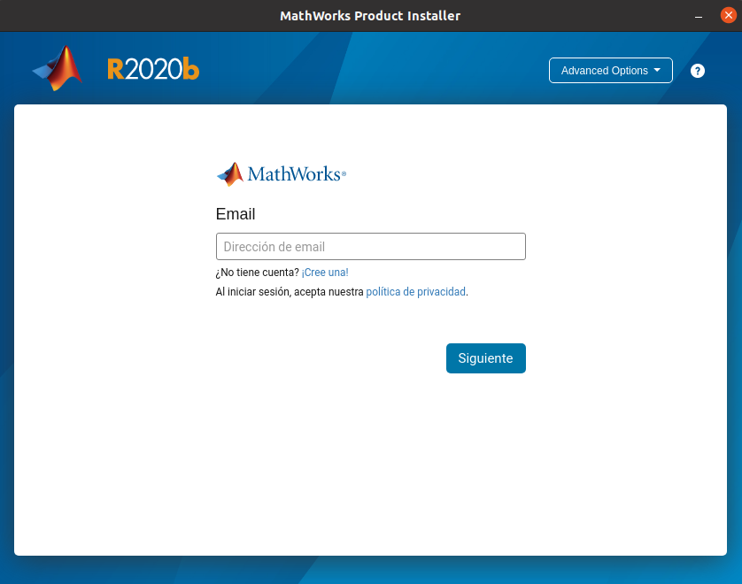

#### 2.2. Go to the link and log in to get a temporary code and enter it on the installer GUI.

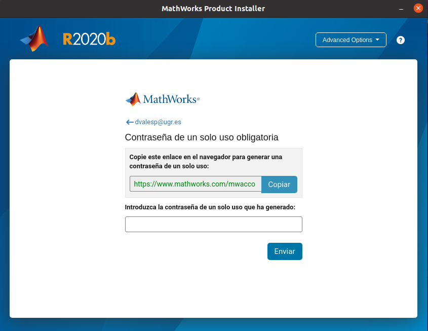

#### 2.3. Click on 'Advanced Options' on the top right corner and select "I want to download without installing".

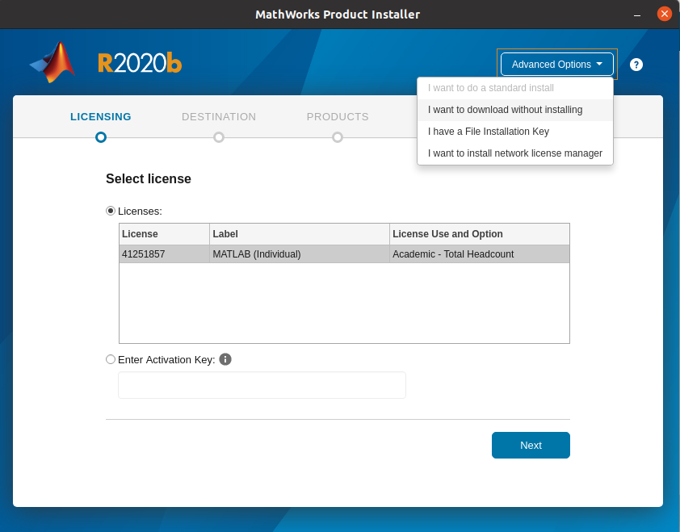

#### 2.4. Select the destination folder for the downloaded files.

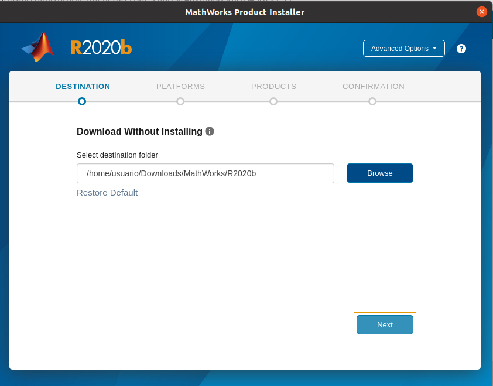

#### 2.5. Choose 'Linux' as platform.

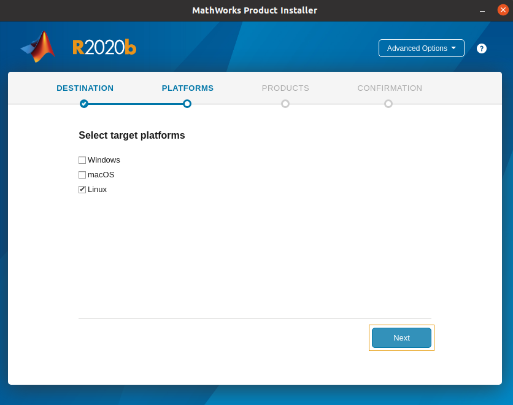

#### 2.6. Select the products and toolboxes you want to install. MATLAB must be one of them.

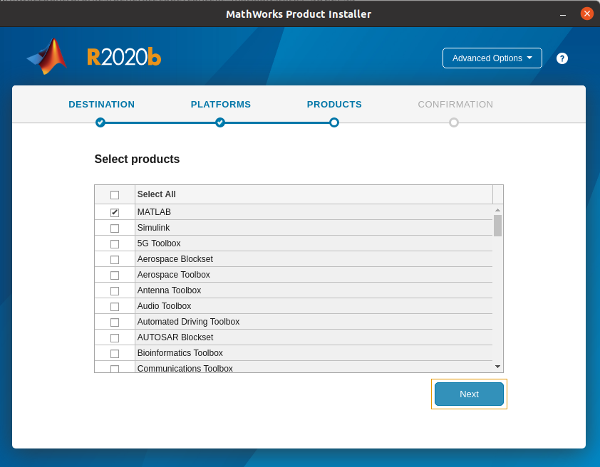

#### 2.7. Click on 'Begin Download'. Wait for the download to complete.

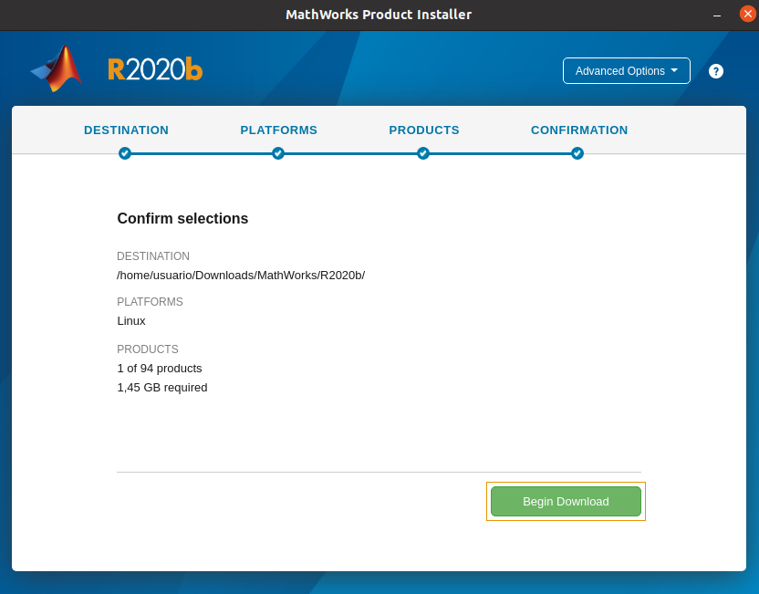

#### 2.8. Go to the destination folder you selected in Step 2.4 and compress the downloaded folder. 

If you chose the default destination folder, the downloaded folder should be `Downloads/MathWorks/R2020b` inside your user directory.

### 3. SERVER PREPARATIONS

You need X11 to be able to see the graphic interface when installing. When you connect to the server, use `ssh` with the option `-X` or use **MobaXterm**.

#### 3.1. Upload the new .zip file to the `DigiVolCan/installation/MATLAB` folder on the remote server. Create the `MATLAB` folder if it doesn't exist.

#### 3.2. Open a terminal on the `DigiVolCan/installation/MATLAB` folder. 

#### 3.3. Unzip the compressed files by running `unzip R2020b -d R2020b_installer` (change the version name to the one you downloaded).

#### 3.4. Run `chmod -R u+rwx R2020b_installer`.

This will give you permissions over the installer folder.

#### 3.4. Delete the .zip file by running `rm R2020b.zip`.

#### 3.5. Run `R2020b_installer/R2020b/bin/glnxa64/install_unix_legacy`.

A new window will open with instructions on how to activate and install MATLAB.

### 4. MATLAB INSTALLER GUI (REMOTE)

Follow these steps to install and activate your license on the server. Click 'Next' after every step.

#### 4.1. Select '**Log in** with a MathWorks account'.

If you don't use internet connection, you will need to use a File Installation Key. Go to the _End Users - Campus-Wide and Startup Individual Licenses_ section in <https://www.mathworks.com/matlabcentral/answers/102845-where-can-i-find-the-activation-key-and-file-installation-key-for-my-license> for more information.

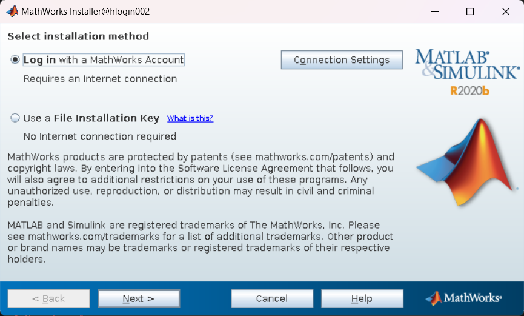

#### 4.2. Agree with the terms of the license.

#### 4.3. Log in to your MathWorks account. An error message might pop up, but it's normal.

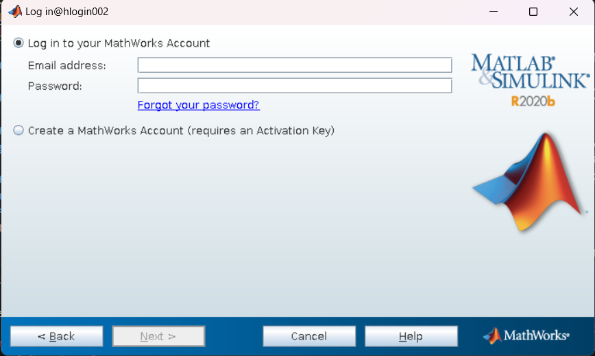

#### 4.4. Copy the link in the error message to a browser, log in and enter the code in the password field.

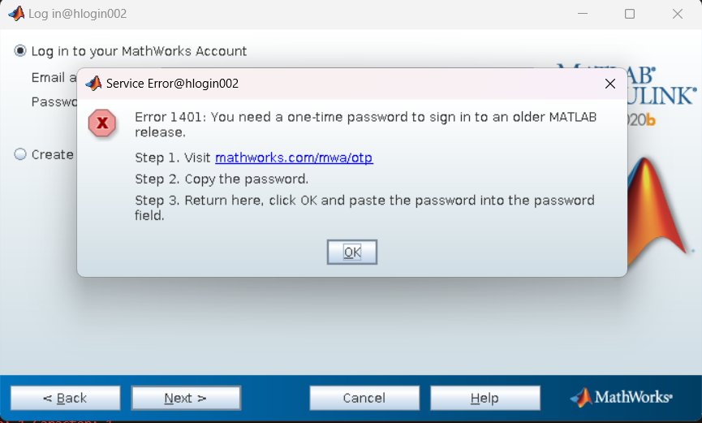

#### 4.5. Select your license.

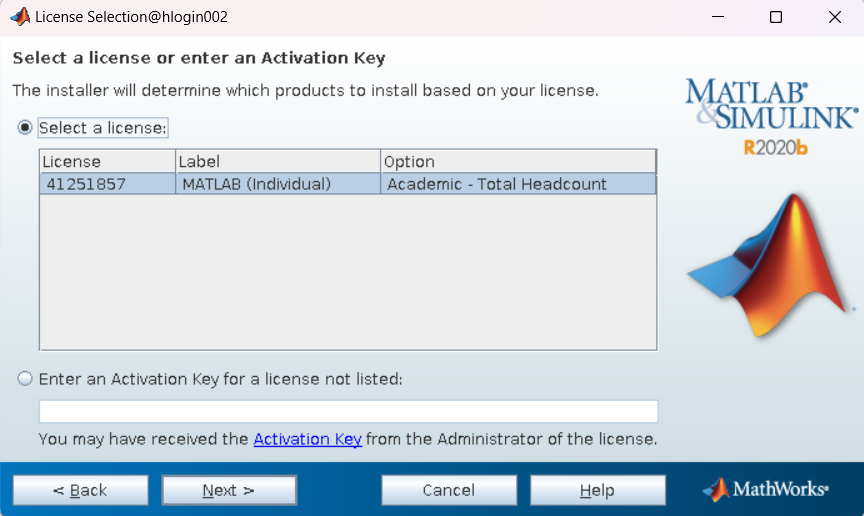

#### 4.6. When asked for the installation folder, enter the absolute path to `DigiVolCan/installation/MATLAB/R2020b`. For example, `/home/$USER/DigiVolcan/installation/MATLAB/R2020b`.

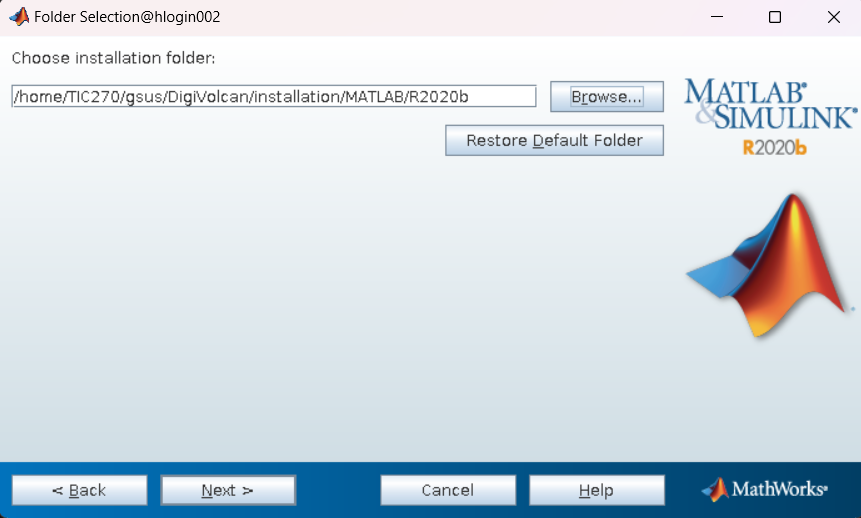

#### 4.7. Select the products you want to install on the server from the list of products your downloaded in Step 2.6.

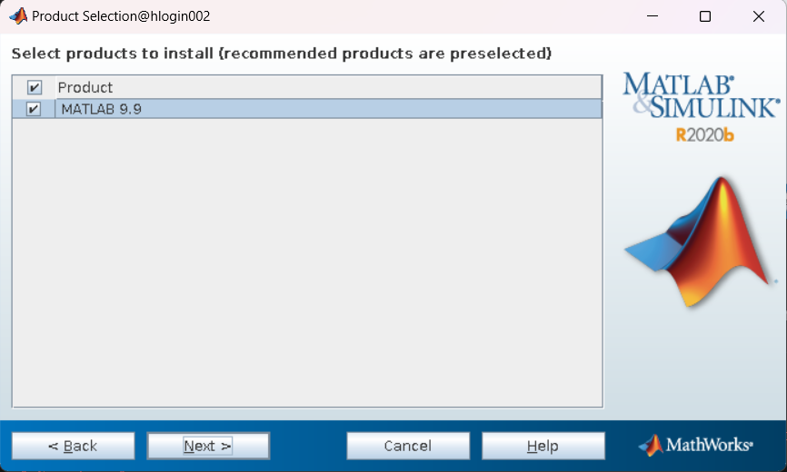

#### 4.8. Leave the option for 'Symbolic Links' unchecked. You can uncheck the 'Help Improve MATLAB' if you want.

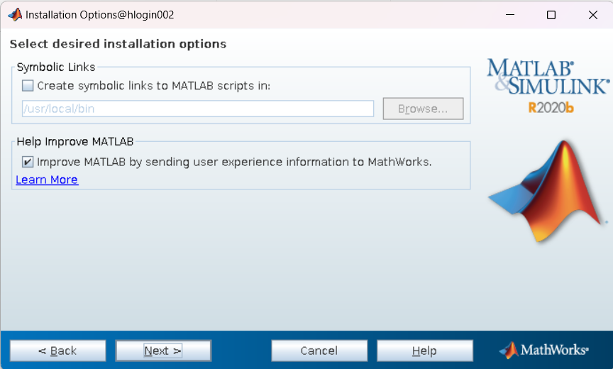

#### 4.9. Click on 'Install' and wait for the installation to complete.

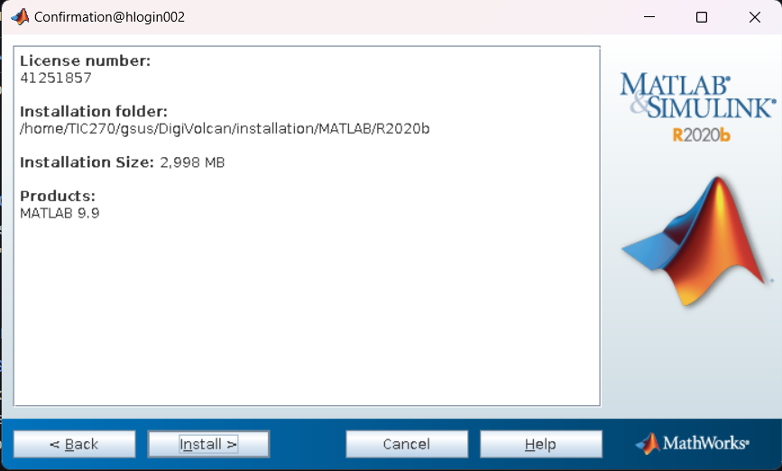

#### 4.10. The installation might stop at some point. If this happens, click 'Next'. Follow the steps on the new Activation window.

You just need to confirm the details of your license.

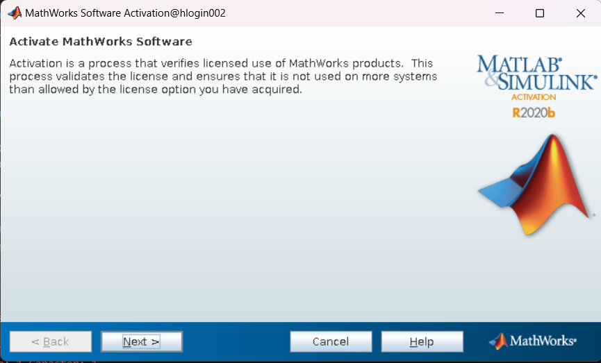

MATLAB should now be installed on the remote server.

#### 4.11. Remove the installer by running `rm -r R2020b_installer`.

### 5. RUN MATLAB

Once it is installed, run `R2020b/bin/matlab`. This will open MATLAB's graphic user interface (GUI).

If you want to run a MATLAB script on a terminal without the GUI, run `R2020b/bin/matlab -batch "<script_path>"`.
